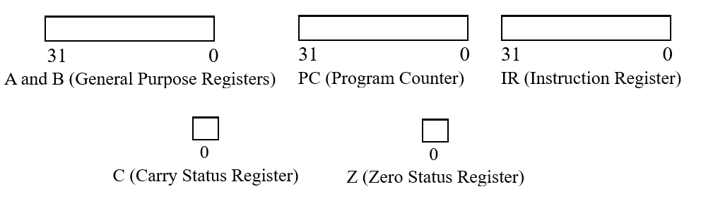
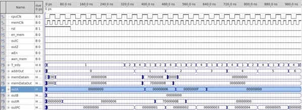
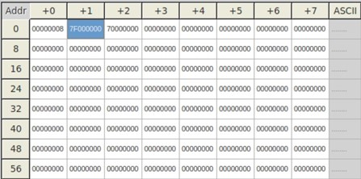
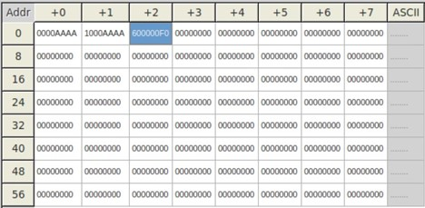

# 16-bit-RISC-CPU
## **Abstract**
This document presents the development and operational testing of a 16-bit RISC CPU with a Harvard-based microarchitecture, featuring a 32-bit external data bus, 16-bit instruction bus, and an 8-bit data memory bus. The design includes 256B of instruction memory and a 1KB custom data memory, supported by two 32-bit working registers. Employing a multi-cycle instruction set optimized for Load/Store operations, the CPU effectively handles direct addressing and complex data manipulations. Extensive validation through waveform analysis confirms the CPU’s high reliability and performance, making it well-suited for educational and developmental applications in computer systems.

## **Introduction**
The development of the 16-bit RISC CPU showcases a Harvard-based microarchitecture that optimizes the separation of data and instruction handling for enhanced processing efficiency. With a 32-bit external data bus, 16-bit instruction bus, and an 8-bit data memory bus, the design supports substantial operational flexibility. Key features include 256B of instruction memory and a 1KB custom data memory, alongside two 32-bit working registers, A and B, that facilitate complex data computations. This setup employs a multi-cycle instruction process with a streamlined instruction set, balancing simplicity with robust functionality. This introduction previews the detailed exploration of the CPU's architecture, register configuration, and execution processes described in the following sections.

## **Specifications**
 The outlined design features were as follows:
 
* A 32-bit external data bus, 16-bit instruction bus, and 8-bit data memory bus. The 16-bit memory address enables 256B of instruction memory whereas the custom-made data memory supports 1KB.
* Two visible 32-bit working registers (A and B) used to store operands and results of data computation.
* A Load/Store, Harvard-based architecture, wherein, all data computations are performed in the working registers and consisting of separate instruction and data storage units.
* Multi-cycle instructions along with a simple instruction set. 

### Instruction Set Architecture 

Fig. 1. Instruction Format

Table I. Mnemonic Instruction Set Architecture 

The instruction set's architecture is streamlined, with each instruction encompassing a 32-bit length and occupying a 4-byte memory space. In direct addressing mode, the lower 16 bits can denote either a memory address or a constant value, while only the 8 least significant bits are employed for memory addressing during data storage and retrieval operations. Instructions not involved in memory addressing are dedicated to data manipulation and program flow control, conforming to one of two depicted format structures in Figure 1. The processor's instruction set, outlined in Table 1, enumerates instructions through mnemonic representation and structural configuration. The operation type is indicated by the instruction's most significant 4 bits (IR [31…28]), which discern addressing or data processing operations—the latter identified by an OpCode of "0111". Within instructions, the bits IR [15…0] define the precise value for the operation, such as embedding a 16-bit constant into the upper half of register A during a 'Load Upper Immediate' (LUI) operation. Immediate (IMM) operations like 'Load Immediate' (LDAI) and 'Add Immediate' (ADDI) directly propagate their value to the target registers and signals, as exemplified by the execution of LDAI resulting in the assignment A <= IR [15…0].

### Register Set

Fig. 2. System Registers

The processor is equipped with several registers that facilitate a variety of operations, some of which are available for user access, while others fulfill internal operational needs. The user-accessible registers are delineated in Figure 2. Registers A and B are designated as 32-bit working registers for executing data processing tasks. Registers C and Z are 1-bit status registers that signal 'Carry' and 'Zero' conditions, respectively—these are generally utilized in branch operations. Registers not visible to the user are dedicated to internal functions, as depicted in Figure 2. Among these, the PC (Program Counter) is pivotal during instruction execution, pinpointing the address for the subsequent instruction. The IR (Instruction Register) is tasked with storing instructions and decoding them for execution.

### Instruction Execution

Fig. 3. Instruction Execution State Diagram

Fig. 4. Data Memory Enable State Diagram

The processor operates using a state machine, cyclically executing each instruction from its set, with each instruction's completion spread across three distinct clock cycles, designated as T0, T1, and T2 phases, shown in fig. 3. These cycles are intricately associated with a series of operations as detailed below:

* T0: Instruction Fetch 1 - During this initial phase, the state machine retrieves the address of the forthcoming instruction from the Program Counter (PC). The PC's current value, which points to the next instruction, is then moved to the Instruction Register (IR).
* T1: Instruction Fetch 2 and Memory Preparation - The state machine progresses the PC, aligning it with the subsequent instruction, and primes the memory for access. This preparation phase is critical for ensuring data is ready for the ensuing operations:
  * For operations like LDA/LDB, control signals are activated to initiate data transfer from memory to the A/B registers, preparing for the information to be captured in T2.
  * For STA/STB operations, the write-enable and other control signals, along with the multiplexer settings, are asserted to configure the system for the data's storage by the end of T2.
 
It is essential during this phase that the PC is also advanced in tandem with the memory's pre-decoding process, aligning with the state machine's sequential nature. Further details and nuances regarding the data memory enable states are outlined in Fig. 4.
* T2: Instruction Decode and Execution - At this juncture, the instruction previously fetched is deciphered by inspecting its content within the IR. The IR's uppermost bits (IR[31..28]) and the immediate data bits (IR[15..0]) guide the state machine in identifying the operation's nature—whether it involves addressing or data processing. Execution is enacted in this phase, with operations like LDA/LDB and STA/STB being actualized. Specifically, for memory storage operations, the system ensures that multiplexer signals remain active for the precise duration to achieve correct data storage.

This sequence of operations within the state machine is perpetually iterative, ensuring continuous processing and execution of instructions.

## **Design**
The project was designed and built iteratively starting with the 32-bit Program Counter and Registers, these units were then tested and confirmed functional through waveform analysis. Afterward, a series of additional components were systematically engineered and evaluated, including:
* A 32-bit Arithmetic Logic Unit (ALU)
* A 1KB (256-word x 32-bit) Data Memory module
* An Upper Zero Extender (UZE) and a Lower Zero Extender (LZE)
* A Reducer Unit (RED) designed for bit-reduction from 32 to 8-bits
* Multiplexers (MUXs) with 2-bit and 3-bit configurations for variable data path routing
* A comprehensive Data Path file to integrate and facilitate communication between these components

Fig. 5. Data Path Block Diagram

Following the successful integration and functional verification of the complete data path, fig. 5, attention was shifted to the design of a CPU control unit. This unit was architecturally composed of a state generator, memory signal generator, and a decoder, all designed to manage the CPU operations with a minimal set of input signals—namely, Enable, Clock (Clk), Memory Clock (mClk), Instruction Word (INST), Carry Flag (C Flag), and Zero Flag (Z Flag). This Control Unit dynamically produces the necessary control signals to coordinate activities across all units within the data path in alignment with the decoded instructions.

Fig. 6. Reset Circuit Block Diagram

Fig. 7. Reset Circuit Waveform Analysis

Post verification of the control unit's adherence to all functionalities outlined in tbl. 1, the design phase proceeded with the development of a CPU reset circuit, illustrated in fig. 6, and its subsequent testing as shown in fig. 7. Furthermore, a 256-byte Instruction Memory was implemented, programmable via a Memory Initialization File (.mif). This design choice significantly streamlines the CPU’s operational control by reducing the number of signals required for execution. This holistic approach in constructing the CPU mirrors real-world systems where users are abstracted from the complexities of converting software programs into executable machine-level instructions. This abstraction is crucial for enhancing usability and efficiency in practical computing environments.

## **Results and Conclusion**

Fig. 8. Mif1 - LDAI, STA, CLRA, and LDA .mif

Fig. 9. Timing Waveform Analysis of Mif1

Fig. 10. Mif2 - LDBI, STB, CLRB, and LDB .mif

Fig. 11. Timing Waveform Analysis of Mif2

Fig. 12. Mif3 - LUI

Fig. 13. Timing Waveform Analysis of Mif3

Fig. 14. Mif4 - JMP

Fig. 15. Timing Waveform Analysis of Mif4

Fig. 16. Mif5 - ANDI

Fig. 17. Timing Waveform Analysis of Mif5

Fig. 18. Mif6 - ADDI

Fig. 19. Timing Waveform Analysis of Mif6

Fig. 20. Mif7 - ORI

Fig. 21. Timing Waveform Analysis of Mif7

Fig. 22. Mif8 - ADD

Fig. 23. Timing Waveform Analysis of Mif8

Fig. 24. Mif9 - SUB

Fig. 25. Timing Waveform Analysis of Mif9

Fig. 26. Mif10 - DECA

Fig. 27. Timing Waveform Analysis of Mif10

Fig. 28. Mif11 - INCA

Fig. 29. Timing Waveform Analysis of Mif11

Fig. 30. Mif12 - ROL

Fig. 31. Timing Waveform Analysis of Mif12

Fig. 32. Mif13 - ROR

Fig. 33. Timing Waveform Analysis of Mif13

Fig. 34. Mif14 - BEQ

Fig. 35. Timing Waveform Analysis of Mif14

Fig. 36. Mif15 - BNE

Fig. 37. Timing Waveform Analysis of Mif15

As demonstrated in the waveforms above, figs. 8-37, the CPU exhibits flawless execution of all instructions loaded from the Instruction Memory. This comprehensive validation underscores the CPU's robust design and its capability to accurately process and execute a diverse set of instructions. The waveforms effectively illustrate the precise timing and accurate data handling by each component of the CPU, confirming that the implemented architecture not only meets the specified requirements but also performs with optimal efficiency and reliability. Each instruction transition is handled seamlessly, showcasing the CPU's adeptness in managing complex computational tasks and its readiness for deployment in real-world applications.

